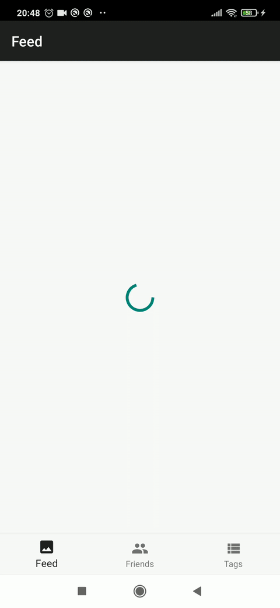

# CleanSamples

 

This is a starting point for **Android** projects designed with **Clean Arquitecture**, intended to be understable, testable and scalable. This project is preconfigured with essentials libraries and tools, as well as modules, interfaces, base classes and sample apps, just ready for you to start your Android app. We make use of https://dummyapi.io/ to fetch the data from a RESTful API.

## Project structure
The project is Gradle optimized, and divided in modules so that each one has only the required dependencies:
* **/apps/** Android apps, only depends on Android SDK and presentation layer.
* **/shared/presentation/** Contains the presenters. Depends on data layer.
* **/shared/data/** Contains the services and data source definitions. Depends on domain layer.
* **/shared/impl/** Contains the implementation of interactors, services and repositories. Depends on data and domains layers and in data access libraries (Retrofit, Ktor, SQLite, ...). This folder also contains unit tests fetching data from a mock server.
* **/shared/domain/** Contains the data entities and the use cases interfaces. Only has a dependency on kotlin serialization library.

## Apps and architecture used
Each sample app is made with a different presentation architecture:
* [x] /apps/mvpapp: MVP (Model View Presenter)
* [x] /apps/mvvmapp: MVVM (Model View View-model).
* [ ] /apps/mviapp: MVI (Model View Intent)

## Features
* [x] UserList
* [x] UserDetail
* [x] PostList
* [x] PostDetail
* [x] TagList
* [x] TagDetail

## Network implementation
* [x] Ktor
* [ ] Retrofit

## Unit Tests
* [x] UsersUseCases
* [x] PostsUseCases
* [x] TagsUseCases

## Instrumentation Tests
* [ ] UserListFragment
* [ ] UserDetailActivity
* [ ] PostListFragment
* [ ] PostDetailActivity
* [ ] TagListFragment
* [ ] TagDetailActivity

## License

    Copyright 2020 Eduardo Rodriguez Ayuso

    Licensed under the Apache License, Version 2.0 (the "License");
    you may not use this file except in compliance with the License.
    You may obtain a copy of the License at

       http://www.apache.org/licenses/LICENSE-2.0

    Unless required by applicable law or agreed to in writing, software
    distributed under the License is distributed on an "AS IS" BASIS,
    WITHOUT WARRANTIES OR CONDITIONS OF ANY KIND, either express or implied.
    See the License for the specific language governing permissions and
    limitations under the License.
